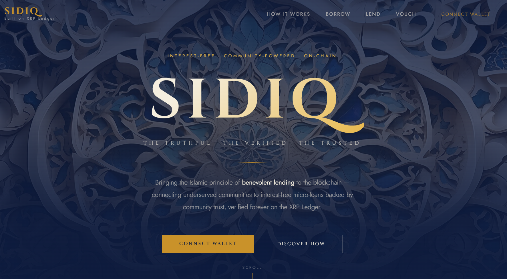
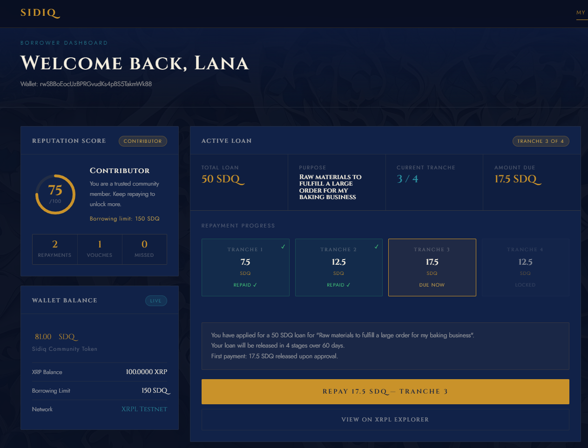
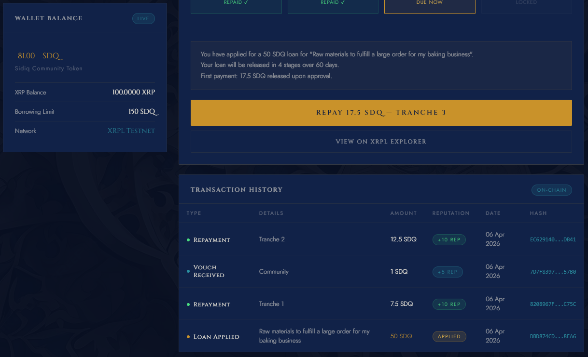
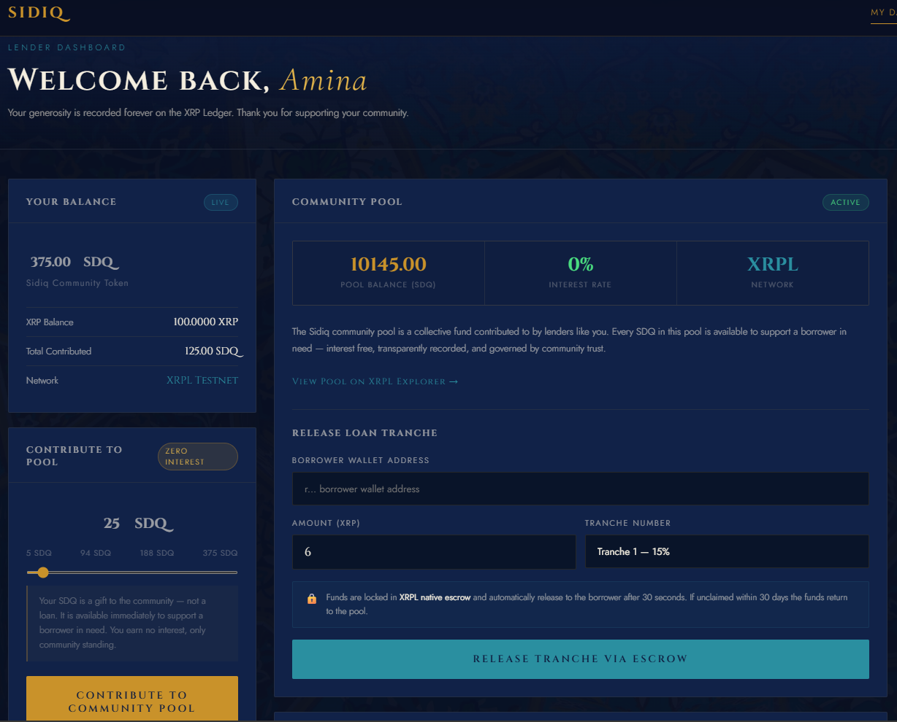
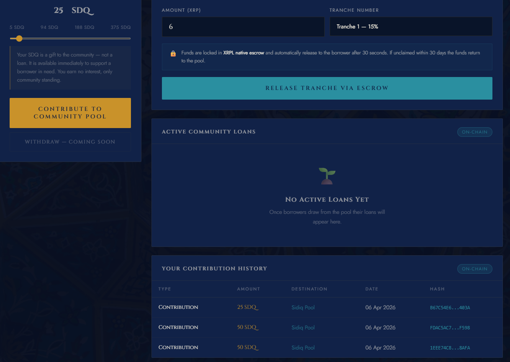
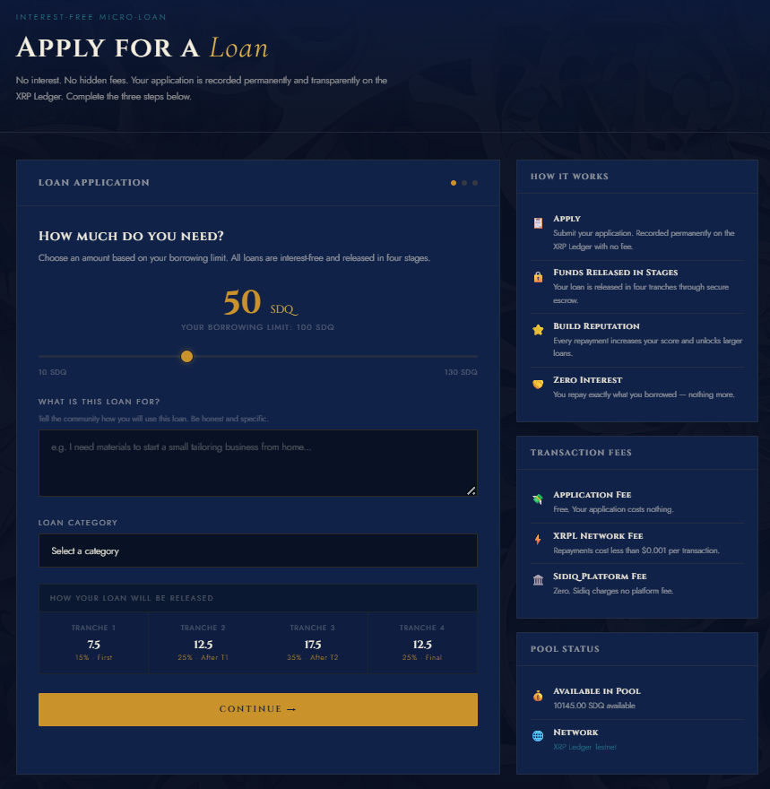
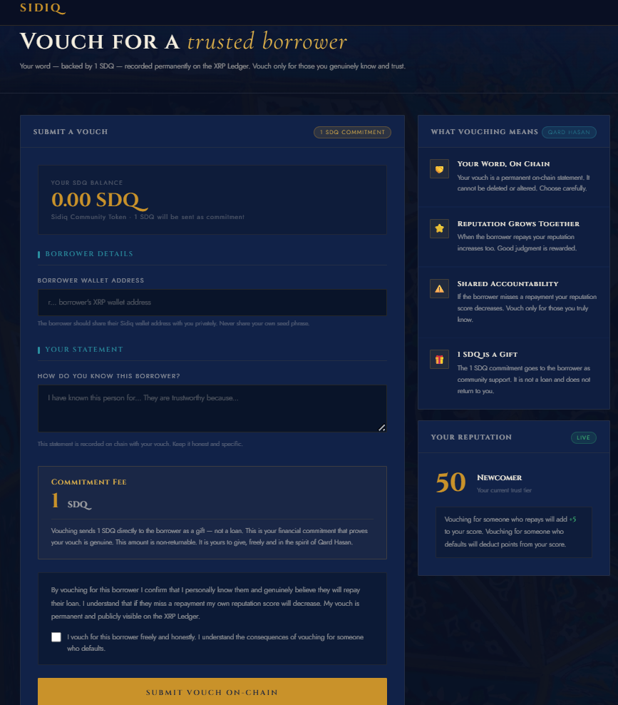

# Sidiq — Interest-Free Community Lending on XRPL

> *Sidiq (صِدِّيق) — Arabic/Urdu for "the truthful". A decentralised interest-free, community micro-lending platform built on the XRP Ledger, inspired by the Islamic principle of Qard Hasan.*

---

## Live Demo

🌐 **[madihasiddiqzafar.github.io/Sidiq](https://madihasiddiqzafar.github.io/Sidiq/)**

---

## What is Sidiq?

Sidiq is a decentralised, community-trust based micro-lending application built on the XRP Ledger that gives Muslim and underserved communities access to interest-free micro-loans — without charging interest.

Inspired by the Islamic principle of **Qard Hasan** — a benevolent loan given without expectation of profit — Sidiq replaces the centralised institution with a transparent, community-governed lending pool on the XRP Ledger. Every contribution, application, disbursement, vouch, and repayment is permanently and immutably recorded on chain.


---

## The Problem

- **1.8 billion Muslims** globally need access to credit but cannot use conventional interest-based lending due to religious principles
- Existing digital microfinance apps in Saudi Arabia charge between **21% and 89% APR** — the opposite of financial inclusion
- The truly unbanked — informal workers, women without formal employment, expatriate workers — cannot meet documentation requirements
- **Saudi Arabia ranks 132 out of 146** countries in the WEF Global Gender Gap Report 2025
- Informal community lending exists but has no accountability infrastructure — when trust breaks, everything breaks
- **No minimum wage** exists for expatriate workers in Saudi Arabia — leaving millions financially vulnerable

---

## The Solution

Sidiq brings Qard Hasan on chain. Three pillars:

- **Community Pool** — lenders contribute SDQ tokens voluntarily to a collective pool. No balance sheet risk. No profit motive in the lending itself.
- **On-Chain Reputation** — every repayment, vouch, and contribution builds a permanent trust score. No credit bureau. No manipulation. The ledger remembers.
- **Zero Interest** — not reduced, not offset, not buried in fees. 0%. Always.

---

## Screenshots

### Landing Page


### Borrower Dashboard



### Lender Dashboard



### Loan Application


### Vouching Page


---

## XRPL Features Used

| Feature | How Sidiq Uses It |
|---|---|
| **Custom Token (SDQ)** | Sidiq Community Token issued via trust lines — used for all lending activity |
| **Native Escrow** | Tranche-based loan disbursement with FinishAfter and CancelAfter conditions |
| **Memo Transactions** | Permanent on-chain records for contributions, applications, repayments, and vouching |
| **AccountSet** | Fee-free loan applications recorded on the borrower's wallet with zero XRP transferred |
| **Payment Transactions** | Lender contributions, borrower repayments, and community vouching (1 SDQ commitment) |
| **Reputation Engine** | Reads borrower, lender, and voucher transaction history — calculates trust score dynamically |

---

## Tech Stack

- **Blockchain:** XRP Ledger Testnet
- **Blockchain Library:** xrpl.js (Node.js for scripts, browser CDN for frontend)
- **Frontend:** Vanilla HTML, CSS, JavaScript — no frameworks, no build process
- **Custom Token:** SDQ issued via XRPL trust lines
- **Backend:** None — the blockchain is the infrastructure
- **Fonts:** Cinzel, Cormorant Garamond, Jost (Google Fonts)
- **Design:** Islamic geometric art aesthetic — navy, gold, turquoise palette

---
## Live Testnet Activity

View the Sidiq community pool on the XRPL testnet explorer:
[testnet.xrpl.org/accounts/rMNNVayuWnBmxdFJ3NK5C4rTQ1rLhTJHQU](https://testnet.xrpl.org/accounts/rMNNVayuWnBmxdFJ3NK5C4rTQ1rLhTJHQU)

All contributions, escrow disbursements, and repayments are publicly visible.

## Architecture

```
Landing Page (index.html)
        ↓
Connect Wallet — routes by address
        ↓
┌─────────────────────┐         ┌──────────────────────┐
│  Lender Dashboard   │         │  Borrower Dashboard  │
│  (lender.html)      │         │  (dashboard.html)    │
│                     │         │                      │
│  • Contribute SDQ   │         │  • View Reputation   │
│  • Pool Balance     │         │  • Active Loan       │
│  • Release Tranche  │         │  • Repay Tranche     │
│  • Contribution     │         │  • Transaction       │
│    History          │         │    History           │
└─────────────────────┘         └──────────────────────┘
        ↓                                ↓
┌─────────────────────┐         ┌──────────────────────┐
│   Vouch Page        │         │  Loan Application    │
│   (vouch.html)      │         │  (apply.html)        │
│                     │         │                      │
│  • Enter borrower   │         │  • Dynamic rep score │
│  • Preview rep      │         │  • Borrowing limit   │
│  • 1 SDQ commitment │         │  • Tranche preview   │
│  • On-chain vouch   │         │  • On-chain submit   │
└─────────────────────┘         └──────────────────────┘
                    ↓
            XRPL Testnet
    Pool Wallet → Escrow → Borrower Wallet
```

---

## Reputation System

Every wallet has an on-chain reputation score between 0 and 100 calculated dynamically from transaction history.

### Scoring Rules

| Action | Score Change | Who Benefits |
|---|---|---|
| Successful tranche repayment | +10 | Borrower |
| Vouch received from community | +5 | Borrower |
| Vouch given to another member | +3 | Voucher |
| Pool contribution made | +8 | Lender |
| Missed tranche repayment | -20 | Borrower |

### Trust Tiers

| Tier | Score Range | Borrowing Limit | Governance |
|---|---|---|---|
| Newcomer | 0 — 59 | Score × 2 SDQ | None |
| Contributor | 60 — 79 | Score × 2 SDQ | Community voice |
| Verified | 80 — 100 | Score × 2 SDQ | Governance panels |

### Role Detection

The reputation engine automatically identifies each wallet's role based on transaction history:

- **Borrower** — wallet has repayment history and no contributions
- **Lender** — wallet has contribution history and no repayments
- **Lender & Borrower** — wallet has both contribution and repayment history
- **Voucher** — any wallet that has submitted SIDIQ_VOUCH transactions

---

## Demo Wallets

| Name | Role | Description |
|---|---|---|
| **Amina Al-Hassan** | Lender | Community member contributing SDQ to the pool |
| **Lana** | Borrower | Small business owner applying for a micro-loan |
| **Khalid Ibrahim** | Voucher | Community member vouching for Lana |
| **Sidiq Pool** | Pool | Community lending pool wallet holding all contributions |

## Demo Wallet Addresses (Public — Testnet Only)

| Wallet | Address | Role |
|---|---|---|
| Sidiq Pool | rMNNVayuWnBmxdFJ3NK5C4rTQ1rLhTJHQU | Community Pool |
| Amina | rJwLw7XmFb6LCC2NbAHJKUUkD2hscfN1Fx | Lender |
| Lana | rwSBBoEocUzBPRGvudKs4pBS5TakmWk88 | Borrower |
| Khalid | rsQCyntjFF5LHKST3qKC9ifmAPMyiPQwHK | Voucher |

---

## Project Flow

### Setup Flow (Terminal — before demo)

```
Step 1:  node scripts/demo_wallets.js
         → Creates 4 funded testnet wallets
         → Save all addresses and seeds

Step 2:  node scripts/create_sdq_token.js
         → Creates SDQ issuer wallet
         → Establishes trust lines for all 4 wallets
         → Issues SDQ tokens to each wallet
         → Save issuer address

Step 3:  Paste all values into HTML files and sidiq.js

Step 4:  node scripts/demo_contribute.js
         → Amina contributes 50 SDQ to the pool
         → Records SIDIQ_CONTRIBUTION memo on chain

Step 5:  node scripts/demo_vouch.js
         → Khalid vouches for Lana with 1 SDQ
         → Records SIDIQ_VOUCH memo on chain
         → Lana's reputation increases by 5

Step 6:  node scripts/demo_apply.js
         → Lana submits loan application via AccountSet
         → Records SIDIQ_LOAN_APPLICATION memo on chain
         → Zero XRP transferred — no application fee

Step 7:  node scripts/demo_escrow.js
         → Pool creates EscrowCreate for Lana (Tranche 1)
         → Waits 30 seconds for release time
         → Lana claims via EscrowFinish
         → Records SIDIQ_LOAN_DISBURSEMENT memo on chain

Step 8:  node scripts/demo_repay.js
         → Lana repays Tranche 1 to pool
         → Records SIDIQ_REPAYMENT memo on chain
         → Lana's reputation increases by 10
```

### Live Demo Flow (Browser — during demo)

```

Scene 1 — Khalid Vouches
Open landing page
→ Enter Khalid's address
→ Routed to vouch.html
→ Enter Lana's address — reputation preview loads
→ Write statement
→ Click Submit Vouch
→ Confirmation modal
→ Confirm — 1 SDQ sent to Lana on chain
→ Show transaction on testnet.xrpl.org
 
Scene 2 — Amina Contributes
Back to landing page
→ Enter Amina's address
→ Routed to lender.html
→ Show pool balance and contribution history
→ Move slider to contribution amount
→ Click Contribute to Community Pool
→ Confirmation modal
→ Confirm — SDQ sent to pool on chain
→ Pool balance updates
 
Scene 3 — Lana Repays
Back to landing page
→ Enter Lana's address
→ Routed to dashboard.html
→ Show reputation score — boosted by Khalid's vouch
→ Show active loan and tranche progress
→ Click Repay Now
→ Confirmation modal
→ Confirm — SDQ sent to pool on chain
→ Reputation score increases
→ Show transaction hash on testnet.xrpl.org
```

---

## Memo Data Structure

All on-chain records use structured JSON encoded as hex in XRPL memo fields.

### SIDIQ_CONTRIBUTION
```json
{
  "type": "SIDIQ_CONTRIBUTION",
  "lender": "r...",
  "amount_sdq": 50,
  "currency": "SDQ",
  "message": "Community lending contribution to Sidiq pool",
  "timestamp": "2026-04-07T00:00:00.000Z"
}
```

### SIDIQ_VOUCH
```json
{
  "type": "SIDIQ_VOUCH",
  "voucher_address": "r...",
  "borrower_address": "r...",
  "statement": "I personally know this borrower and trust them to repay",
  "timestamp": "2026-04-07T00:00:00.000Z"
}
```

### SIDIQ_LOAN_APPLICATION
```json
{
  "type": "SIDIQ_LOAN_APPLICATION",
  "borrower": "r...",
  "pool_address": "r...",
  "total_amount_sdq": 40,
  "purpose": "Materials for small tailoring business",
  "repayment_period_days": 60,
  "tranches": {
    "tranche_1": 6,
    "tranche_2": 10,
    "tranche_3": 14,
    "tranche_4": 10
  },
  "timestamp": "2026-04-07T00:00:00.000Z"
}
```

### SIDIQ_LOAN_DISBURSEMENT
```json
{
  "type": "SIDIQ_LOAN_DISBURSEMENT",
  "borrower": "r...",
  "amount_sdq": 6,
  "tranche": 1,
  "total_tranches": 4,
  "purpose": "Materials for small tailoring business",
  "timestamp": "2026-04-07T00:00:00.000Z"
}
```

### SIDIQ_REPAYMENT
```json
{
  "type": "SIDIQ_REPAYMENT",
  "borrower": "r...",
  "pool_address": "r...",
  "tranche_number": 1,
  "repayment_amount_sdq": 6,
  "previous_reputation_score": 55,
  "reputation_change": "+10",
  "new_reputation_score": 65,
  "next_tranche_unlocked": true,
  "timestamp": "2026-04-07T00:00:00.000Z"
}
```

---

## Project Structure

```
Sidiq/
│
├── index.html                    # Landing page with wallet routing
├── dashboard.html                # Borrower dashboard
├── lender.html                   # Lender dashboard
├── apply.html                    # Loan application form
├── vouch.html                    # Community vouching page
├── sidiq.js                      # Browser-compatible XRPL functions
├── README.md                     # This file
│
├── scripts/
│   ├── demo_wallets.js           # Creates and funds 4 demo wallets
│   ├── create_sdq_token.js       # Issues SDQ custom token via trust lines
│   ├── demo_contribute.js        # Amina contributes SDQ to pool
│   ├── demo_vouch.js             # Khalid vouches for Lana
│   ├── demo_apply.js             # Lana submits loan application
│   ├── demo_escrow.js            # Creates and claims tranche escrow
│   ├── demo_repay.js             # Lana repays tranche to pool
│   ├── reputation_engine.js      # Calculates reputation from on-chain history
│   └── setup_wallet.js           # Standalone pool wallet creation
│
└── assets/
    ├── pattern_1.jpg             # Islamic carved arabesque background
    ├── patter_2.jpg              # Persian geometric tilework
    ├── patter_3.jpg              # Mughal interior
    └── screenshots/
        ├── landing.png
        ├── borrower_dashboard.png     
        ├── borrower_dashboard_2.png
        ├── lender_dashboard.png  
        ├── lender_dashboard_2.png                  
        ├── apply.png             
        └── vouch.png             
```

---

## Key Functions in sidiq.js

| Function | Description |
|---|---|
| `connectToXRPL()` | Establishes WebSocket connection to XRPL testnet |
| `getSDQBalance(address)` | Returns wallet's SDQ token balance |
| `getPoolBalance()` | Returns community pool SDQ balance |
| `getReputation(address)` | Reads on-chain history and calculates full reputation profile |
| `getActiveLoan(address)` | Returns borrower's current active loan and tranche status |
| `submitLoanApplication(seed, amount, purpose)` | Submits loan application via AccountSet |
| `submitRepayment(seed, amount, tranche, score)` | Repays tranche to pool with reputation memo |
| `submitContribution(seed, amount)` | Lender contributes SDQ to pool |
| `submitVouch(seed, borrowerAddress)` | Community vouch with 1 SDQ commitment |
| `createEscrow(poolSeed, borrower, amount, tranche)` | Creates time-locked escrow for tranche disbursement |
| `claimEscrow(borrowerSeed, poolAddress)` | Borrower claims funds after escrow release time |
| `toHex(data)` | Encodes memo data using browser-native TextEncoder |
| `fromHex(hex)` | Decodes memo data using browser-native TextDecoder |

---

## Limitations and Future Vision

### Current Limitations

- **XRP Volatility** — SDQ has no external market value. Production version will migrate to RLUSD via Single Asset Vaults
- **Manual Tranche Automation** — escrow creation requires manual trigger. Production version will use Flare smart contracts for automation
- **Single Asset Vaults** — amendment not yet active on testnet. Described as future architecture
- **No Formal Sharia Certification** — architecture is designed to be Sharia compliant. Formal fatwa is a future milestone

### Future Roadmap

**Infrastructure and Protocol:**
- Single Asset Vaults — migrate pool to native XRPL vault with proportional share issuance for lenders
- RLUSD Migration — stable dollar-denominated loans eliminating XRP volatility
- Payment Channels — bilateral progressive fund release without individual escrow per tranche
- Flare Smart Contracts — automated tranche releases when repayment conditions confirmed

**Identity and Compliance:**
- DID Integration — XRPL Decentralised Identifiers for portable on-chain financial identity
- Open Banking — optional credit score baseline for users with formal banking history

**Community and Governance:**
- Governance Panels — verified members resolve disputes with conflict of interest protections
- Zakat Charity Pool — micro-fee on disbursements accumulates in charity escrow for those who don't qualify for loans
- Expanded Reputation System — full lender and voucher reputation with governance rights

**Business Model:**
- Platform Fee — 0.5% to 1% Sharia-compliant administrative fee on disbursements
- Institutional Partnerships — Islamic banks and Zakat funds deploy charitable capital through Sidiq
- White Label Deployment — branded Sidiq pools for Islamic finance institutions

---

## Design System

| Element | Value |
|---|---|
| Background | `#0d1b3e` — Midnight Navy |
| Primary Accent | `#c9922a` — Saffron Gold |
| Secondary Accent | `#2a8fa0` — Islamic Turquoise |
| Text | `#f5efe0` — Warm Ivory |
| Heading Font | Cinzel (Google Fonts) |
| Body Font | Jost (Google Fonts) |
| Accent Font | Cormorant Garamond (Google Fonts) |

---

## Qard Hasan Principle

> *"The best of you are those who are best in repayment."*
> — Prophet Muhammad ﷺ

Sidiq does not replace the human spirit of Qard Hasan. It gives it infrastructure.

---

## Important Security Note

All wallet seeds in this repository are placeholders. **Never commit real wallet seeds to a public repository.** Replace all placeholder values with your actual testnet seeds when running locally.

---

## Built During

**XRPL Student Builder Residency — April 2026**
**University of Birmingham — MSc Fintech**

*Let's build with humanity at the heart.*
